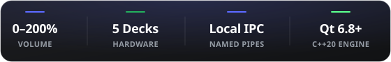

<div align="center">



<br>

[](#-setup--configuration)
[](#-features)
[](#step-2-configure-the-plugin-in-stream-deck)
[](#-troubleshooting--error-codes)
[](#-licence--terms)

<br>



</div>


##  What It Does

Managing voice volume in busy Discord channels usually means Alt-Tabbing or opening Discord, finding the user, and sliding volume bars while gaming or streaming.

**Stream Deck Discord Volume Mixer** brings full Discord voice hardware mixer controls directly to your desk:
- 🔊 **Individual Volume Control**: Adjust any channel member's volume independently in real-time.
- 🔇 **One-Touch Mute / Unmute**: Toggle mute on specific users with a single button press or dial tap.
- 🟢 **Live Speaking Indicators**: Instant visual feedback with vibrant glowing Discord-green borders (`#23A55A`) when a user speaks.
- 🔴 **Mute & Deafen Status**: Quick-glance mute badges (`#ED4245`) and self mic/audio mute controls.
- 🎛️ **Stream Deck + Dial Support**: Full touchscreen LCD feedback and physical rotary encoder volume knobs.

<div align="center">


</div>


##  Features

### Hardware Controls & Feedback

- **Individual User Volumes**: Smooth adjustments from 0% up to 200% with configurable step sizes.
- **One-Click Mute Toggle**: Instant mute/unmute per user without opening Discord menus.
- **Live Speaking Detection**: Dynamic Discord-green border rings (`#23A55A`) and `>>SPEAKING<<` indicators when someone talks.
- **Mute & Deafen States**: Distinctive red badges (`#ED4245`) for muted channel members.
- **Self Voice Management**: Dedicated hotkeys to toggle your own microphone mute and deafen state.
- **Multi-Page Voice Channels**: Next and previous page buttons to easily navigate large channels.

### Controller Compatibility

| Capability | Keypad Keys (Standard, Mini, XL, Mobile) | Rotary Dials (Stream Deck +) |
| :--- | :--- | :--- |
| **Avatar Display** | High-contrast 55% blended avatar | High-resolution circular antialiased avatar |
| **Volume Control** | Volume Up / Down buttons (+ custom step) | Physical rotary encoder knob |
| **User Mute Toggle** | Key press toggles user mute | Dial push or touchscreen tap (configurable) |
| **Speaking Ring** | Vibrant green border overlay | Glowing green ring on LCD icon |
| **Muted Tag** | Clear `MUTED` status tag | Red outline on LCD icon + `MUTED` value |
| **Paging & Cycling** | Dedicated Next / Previous page keys | Push / Tap to cycle through members |
| **Self Mute / Deafen** | Dedicated self mic / audio toggle buttons | Dedicated self mic / audio toggle buttons |


##  Setup & Configuration

### Prerequisites
- **Discord Desktop Client** running on Windows (10 or 11, 64-bit).
- **Elgato Stream Deck Software** (version 6.4 or newer).

### Step 1: Create Your Discord Application
1. Go to the [Discord Developer Portal](https://discord.com/developers/applications).
2. Click **New Application** and enter a name (e.g., `Deckaro` or `VolumeMixer`).
   
   
   > **Do not use the word "Discord" in your application name**, as Discord's RPC server will reject the connection.

3. Under **OAuth2 → General**:
   - Under **Redirects**, click **Add Redirect** and enter exactly:
     ```
     http://localhost:1337/callback
     ```
   - Click the green **Save Changes** button at the bottom of the page!
4. Under **Client information**:
   - Copy your **Client ID** (Application ID).
   - Click **Reset Secret** (or Copy) to get your **Client Secret**.

<div align="center">


</div>

### Step 2: Configure the Plugin in Stream Deck
1. Drag the **Discord Volume Mixer** action onto your Stream Deck key layout.
2. In the Property Inspector below (scroll down to **Discord settings**):
   - Paste your **Client ID**.
   - Paste your **Client Secret**.
3. Press any Volume Mixer button on your Stream Deck.
4. Discord Desktop will display an authorization popup — click **Authorize**.
5. You're connected! The buttons will instantly populate with members in your current voice channel.

<div align="center">


</div>


##  Troubleshooting & Error Codes

The 2026 edition features intelligent connection recovery, multi-pipe handshake retries (pipes 0–9), and clear human-readable status codes on the buttons:

| Display Text | Meaning | Solution |
| :--- | :--- | :--- |
| `LOADING...` | Plugin is performing handshake or waiting for OAuth approval. | Wait a few seconds or check Discord for an authorization popup. |
| `NO ID/SECRET` | Client ID or Client Secret is empty. | Fill in credentials in the Property Inspector. |
| `NO DISCORD` | Discord desktop process is not found or pipe failed. | Make sure Discord desktop is open and running. Press `Ctrl + R` in Discord. |
| `BAD CLIENT` / `BAD ID` | Discord rejected the Client ID (`RPC 4000`/`4007`). | Verify the Client ID matches the Application ID in the Developer Portal. Press `Ctrl + R` in Discord. |
| `BAD ORIGIN` | Redirect URI mismatch (`RPC 4008`). | Ensure `http://localhost:1337/callback` is saved under OAuth2 Redirects in Developer Portal. |
| `AUTH DENIED` | Authorization popup was canceled or timed out. | Press the button again and click **Authorize** in Discord. |
| `TOKEN FAIL` | HTTP token exchange failed with Discord API. | Check internet connection and verify Client Secret is correct. |
| `TOKEN EXP` | Cached OAuth token was revoked or expired. | The plugin automatically purges stale tokens; re-authorize when prompted. |
| `NOBODY IN VOICE` | You are connected, but not in a voice channel or alone. | Join a voice channel with other users. |


##  Building from Source

### Requirements
- **CMake 3.20+**
- **Qt 6.5+ LTS** (tested on **Qt 6.8.3** with MinGW 13.1.0 and MSVC 2022 x64)
- **C++20** compliant compiler

```powershell
# Configure
cmake -S . -B build -G "MinGW Makefiles" -DCMAKE_BUILD_TYPE=Release -DCMAKE_PREFIX_PATH="C:/Qt/6.8.3/mingw_64"

# Build
cmake --build build -j8

# Install & Deploy to Stream Deck plugins directory
cmake --install build
```


## 👥 Contributors & Credits

| Contributor | Role & Contributions | Profile |
| :--- | :--- | :---: |
| **Danol** | **Original Creator & Architecture** — Creator of the original StreamDeck Discord Volume Mixer, QtStreamDeck2, and QtDiscordIPC foundations. | [@CZDanol](https://github.com/CZDanol) |
| **Thomas Thanos** | **2026 Edition Lead & Maintainer** — Full 2026 modernization, ERR 8 multi-pipe retry engine, Qt 6.8+ LTS / C++20 migration, 3D Apple Squircle design overhaul, deep LCD dark mode, smart nickname elision, and zero re-auth token persistence. | [@thomasthanos](https://github.com/thomasthanos) |
| **Krabs** | **Testing & Profiles** — Testing and profile layout design for the Stream Deck XL version. | [@krabs-github](https://github.com/krabs-github) |

### Third-Party Licenses
- **Qt Framework**: [The Qt Company](https://www.qt.io/) (LGPLv3)
- **Icons**: [Icons8](https://icons8.com/) (Custom 3D Apple Squircle vector remastering)
- For complete details, see [THIRD-PARTY-NOTICES.md](THIRD-PARTY-NOTICES.md).


##  Licence & Terms

**Source-available, all rights reserved.**

The source code in this repository is published for auditing, transparency, and personal non-commercial compilation. Unauthorized redistribution, publishing to marketplace stores (including the Elgato Stream Deck Marketplace), commercial exploitation, or repackaging without prior written permission is strictly prohibited.

[](LICENSE)

---

<div align="center">

<sub>Not affiliated with, endorsed by, or connected to Discord Inc., Elgato, or Corsair.</sub>

</div>

