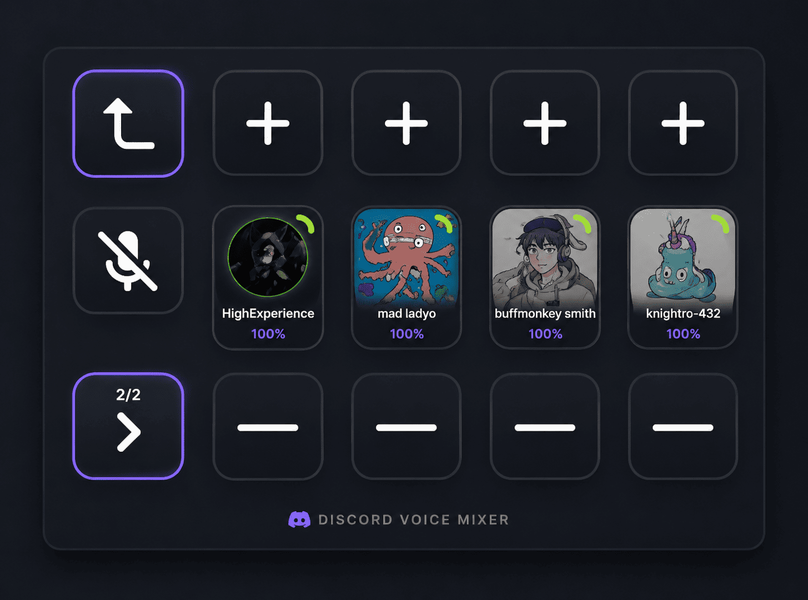

<div align="center">


<br>

[](https://github.com/thomasthanos/StreamDeck-DiscordVolumeMixer-2026/releases/latest)
[](#)
[](#)
[](LICENSE)

<br>


</div>


## 🎮 What It Does

Control your Discord voice chat directly from your Stream Deck without Alt-Tabbing:

- 🔊 **Individual Volumes**: Adjust any voice channel member's volume independently in real-time.
- 🔇 **One-Touch Mute**: Click a user's avatar to instantly mute/unmute them.
- 🟢 **Live Speaking Glow**: Dynamic glowing Discord-green halo (`#23A55A`) around active speakers.
- 🖤 **Obsidian LCD Dark Mode**: Ultra-deep pitch black backgrounds (`#0A0B0C`) for maximum contrast on LCD screens.
- 🎛️ **Stream Deck + Dial Support**: Rotary knobs and touchscreen feedback for volume and user cycling.

<div align="center">



</div>


## ⚡ Quick 3-Step Setup

### 1️⃣ Install the Plugin
Download the latest **[`com.thomast.discordmixer.streamDeckPlugin`](https://github.com/thomasthanos/StreamDeck-DiscordVolumeMixer-2026/releases/latest)** and double-click to install it automatically!

### 2️⃣ Create a Discord App
1. Open the [Discord Developer Portal](https://discord.com/developers/applications) and click **New Application** (name it e.g. `Deckaro` or `Mixer` — *do not include "Discord" in the name*).
2. Go to **OAuth2 → General**:
   - Under **Redirects**, add `http://localhost:1337/callback` and click **Save Changes**.
3. Under **Client Information**, copy your **Client ID** and **Client Secret**.

> Discord restricts local RPC access. During development, sign in to the Discord
> desktop app with the application owner/team account or add that account to the
> application's RPC tester list. Public distribution requires Discord RPC approval.
> Treat the Client Secret as a password: never publish it, commit it, or send it in chat.

<div align="center">


</div>

### 3️⃣ Connect to Stream Deck
1. Drag the **Discord Volume Mixer** action onto any key on your Stream Deck.
2. In the settings panel below, paste your **Client ID** and **Client Secret**.
3. Tap the button and click **Authorize** in the Discord desktop popup. You're ready to go!


## 🔍 Quick Troubleshooting

| Screen Text | What it means | How to fix |
| :--- | :--- | :--- |
| `LOADING...` | Connecting or waiting for approval | Check Discord for an authorization popup |
| `NO DISCORD` | Discord desktop app is not running | Start Discord and press `Ctrl + R` |
| `DISCORD APP REJECTED` / `BAD CLIENT` | Discord rejected the app for RPC | Verify the Client ID, use the owner/team account or an RPC tester, and request Discord RPC approval for public use |
| `DEAUTHORIZE DISCORD` | Discord has a stale authorization grant for the app | Discord Settings → Authorized Apps → Deauthorize the app, then press the Stream Deck key and authorize again |
| `BAD ORIGIN` | Redirect URI missing | Add `http://localhost:1337/callback` under OAuth2 Redirects |
| `NOBODY IN VOICE` | You are not in a voice channel | Join a voice channel with other users |


## 🛠️ Building from Source

You can build and deploy with a single command using PowerShell:

```powershell
# Automated 1-Click Build & Package
.\build.ps1
```

Or manually using CMake:
```powershell
cmake -B build -G "MinGW Makefiles" -DCMAKE_BUILD_TYPE=Release
cmake --build build -j8
cmake --install build
```


## 👥 Contributors & Credits

| Contributor | Contributions | Profile |
| :--- | :--- | :---: |
| **Danol** | **Original Creator** — Architect of the original plugin, QtStreamDeck2 & QtDiscordIPC foundations. | [@CZDanol](https://github.com/CZDanol) |
| **ThomasT** | **2026 Edition Lead** — Full 2026 rewrite, ERR 8 multi-pipe retries, Qt 6.8+ LTS, 3D Apple icons, and token persistence. | [@thomasthanos](https://github.com/thomasthanos) |
| **Krabs** | **Testing & Profiles** — Profile layouts and testing for Stream Deck XL. | [@krabs-github](https://github.com/krabs-github) |

### Third-Party Material
- **Qt Framework**: [The Qt Company](https://www.qt.io/) (LGPLv3)
- **Icons**: [Icons8](https://icons8.com/) (Custom 3D Apple Squircle vector remastering)
- See [THIRD-PARTY-NOTICES.md](THIRD-PARTY-NOTICES.md) for full license notices.


## 📄 License & Terms

Source-available for personal, non-commercial use and auditing. Unauthorized marketplace publishing or commercial repackaging is strictly prohibited. See [LICENSE](LICENSE) for terms.

---

<div align="center">
<sub>Not affiliated with, endorsed by, or connected to Discord Inc., Elgato, or Corsair.</sub>
</div>
