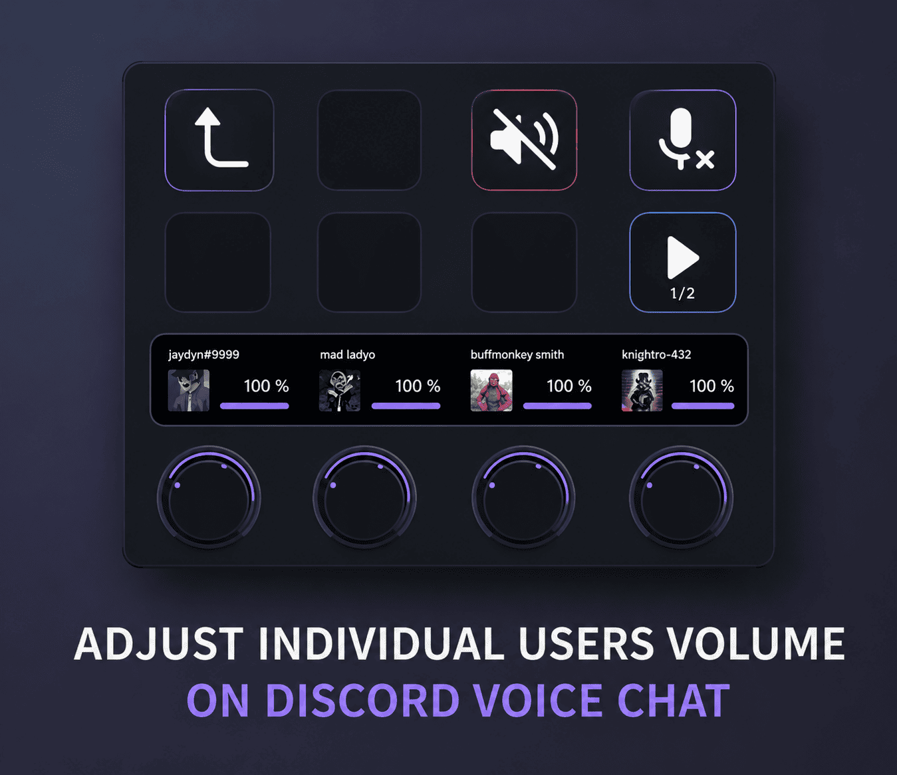
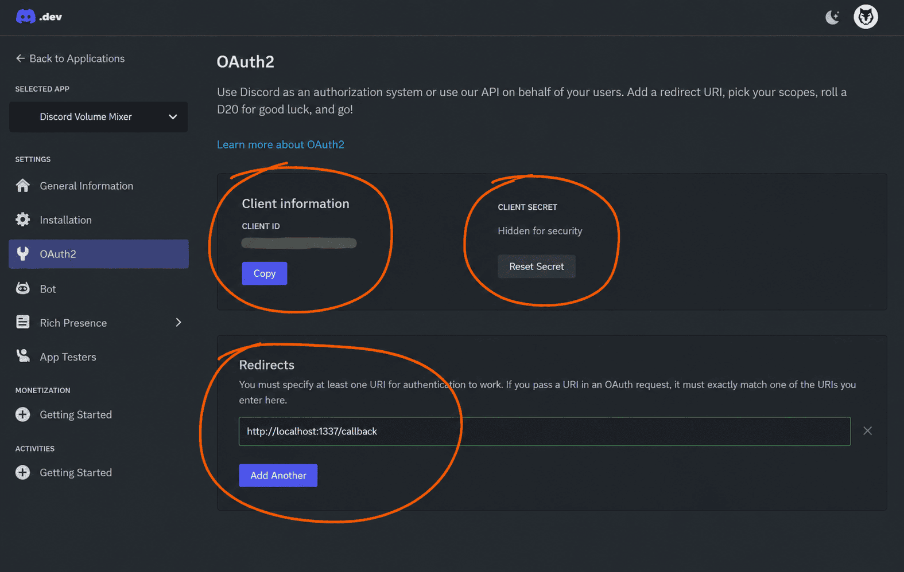
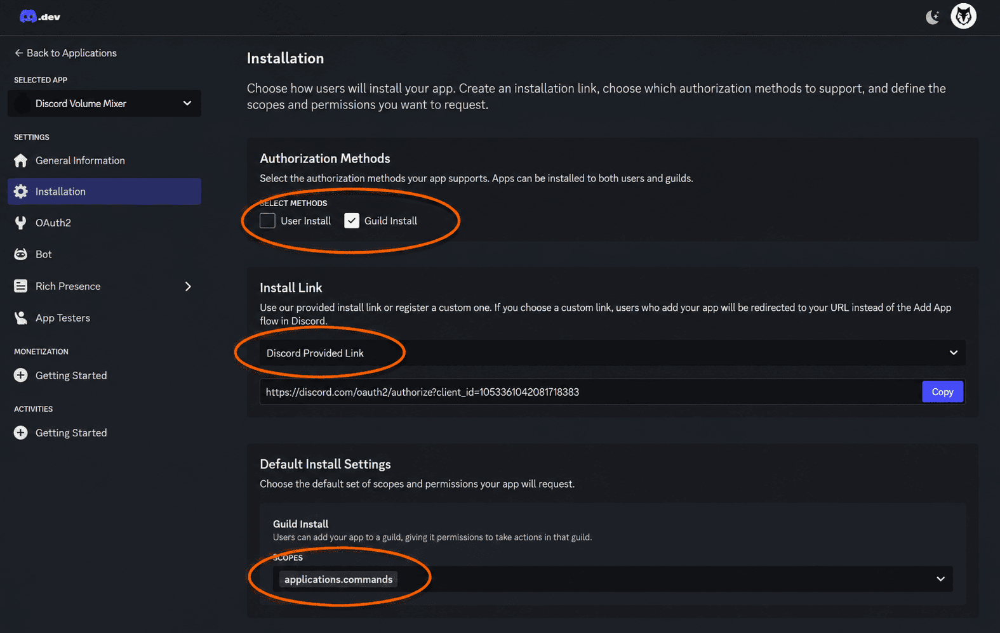
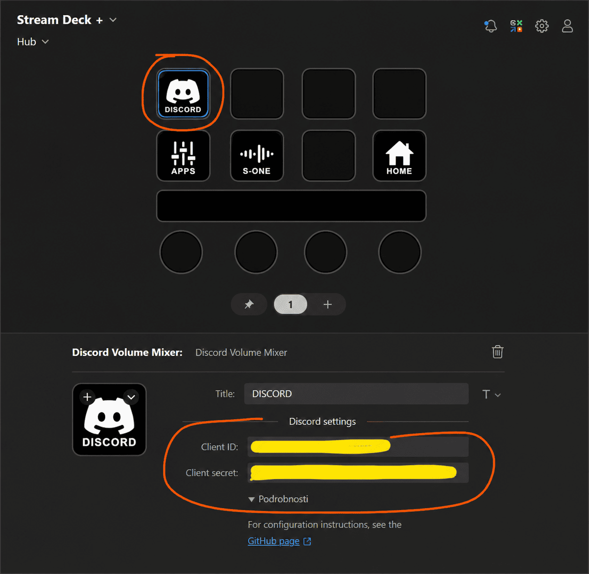

# Stream Deck Discord Volume Mixer (2026 Edition)

<div align="center">

[](https://github.com/thomasthanos/StreamDeck-DiscordVolumeMixer-2026/releases)
[](https://www.qt.io/)
[](https://isocpp.org/)
[](https://developer.elgato.com/documentation/stream-deck/)
[](https://www.microsoft.com/windows)
[](LICENSE.md)

**A high-performance Elgato Stream Deck plugin for individual per-user voice chat volume control and status management in Discord.**

[Features](#-features) • [Installation & Setup](#-setup--configuration) • [Troubleshooting](#-troubleshooting) • [Building from Source](#-building-from-source) • [Credits & Attribution](#-credits--attribution)

</div>

---

## 🎧 What It Does

Managing voice volume in busy Discord channels usually means opening Discord, finding the user, and sliding volume bars while gaming or streaming.

**Stream Deck Discord Volume Mixer** brings full Discord audio mixer hardware controls to your desk:
- 🔊 **Individual Volume Control**: Adjust any channel member's volume independently in real-time.
- 🔇 **One-Touch Mute / Unmute**: Toggle mute on specific users with a single button press or dial tap.
- 🟢 **Live Speaking Indicators**: Instant visual feedback with glowing Discord-green borders (`#23A55A`) when a user speaks.
- 🔴 **Mute & Deafen Status**: Quick-glance mute badges (`#ED4245`) and self mic/audio mute controls.
- 🎛️ **Stream Deck + Dial Support**: Full touchscreen LCD feedback and physical rotary encoder volume knobs.

<div align="center">




</div>

---

## ✨ Features

| Feature | Keypad (Standard, Mini, XL, Mobile) | Rotary Encoders (Stream Deck +) |
| :--- | :--- | :--- |
| **User Avatar Display** | 55% blended avatar background | High-resolution circular antialiased avatar |
| **Volume Adjustment** | Dedicated Volume Up / Down buttons (+ configurable step) | Smooth rotary dial knob with step control |
| **Mute Toggle** | Key press toggles individual user mute | Dial push / LCD tap action (configurable) |
| **Speaking Feedback** | Dynamic green overlay (`>>SPEAKING<<`) | Dynamic glowing green ring on LCD icon |
| **Muted Feedback** | Clear `MUTED` status tag | Red ring outline on LCD icon + `MUTED` value |
| **Channel Navigation** | Multi-page next/previous navigation buttons | Dial push / tap user paging cycling |
| **Self Audio Controls** | Toggle Microphone Mute & Deafen | Toggle Microphone Mute & Deafen |

---

## 🚀 Setup & Configuration

### Prerequisites
- **Discord Desktop Client** running on Windows (10 or 11, 64-bit).
- **Elgato Stream Deck Software** (version 6.4 or newer).

### Step 1: Create Your Discord Application
1. Go to the [Discord Developer Portal](https://discord.com/developers/applications).
2. Click **New Application** and enter a name (e.g., `Deckaro` or `VolumeMixer`).
   > ⚠️ **Important**: Do not use the word *"Discord"* in your application name.
3. Under **OAuth2 → General**:
   - Under **Redirects**, click **Add Redirect** and enter exactly:
     ```
     http://localhost:1337/callback
     ```
   - Click the green **Save Changes** button at the bottom of the page!
4. Under **Client information**:
   - Copy your **Client ID** (Application ID).
   - Click **Reset Secret** (or Copy) to get your **Client Secret**.

<div align="center">




</div>

### Step 2: Configure the Plugin in Stream Deck
1. Drag the **Discord Volume Mixer** action onto your Stream Deck key layout.
2. In the Property Inspector below (scroll down to **Discord settings**):
   - Paste your **Client ID**.
   - Paste your **Client Secret**.
3. Press any Volume Mixer button on your Stream Deck.
4. Discord Desktop will display an authorization popup — click **Authorize**.
5. You're connected! The buttons will instantly populate with members in your current voice channel.

<div align="center">



</div>

---

## 🛠️ Troubleshooting & Error Messages

The 2026 edition features intelligent connection recovery, multi-pipe handshake retries, and clear human-readable status codes on the buttons:

| Display Text | Meaning | Solution |
| :--- | :--- | :--- |
| `LOADING...` | Plugin is performing handshake or waiting for OAuth approval. | Wait a few seconds or check Discord for an authorization popup. |
| `NO ID/SECRET` | Client ID or Client Secret is empty. | Fill in credentials in the Property Inspector. |
| `NO DISCORD` | Discord desktop process is not found or pipe failed. | Make sure Discord desktop is open and running. Press `Ctrl + R` in Discord. |
| `BAD CLIENT` / `BAD ID` | Discord rejected the Client ID (`RPC 4000`/`4007`). | Verify the Client ID matches the Application ID in the Developer Portal. Press `Ctrl + R` in Discord. |
| `BAD ORIGIN` | Redirect URI mismatch (`RPC 4008`). | Ensure `http://localhost:1337/callback` is saved under OAuth2 Redirects in Developer Portal. |
| `AUTH DENIED` | Authorization popup was canceled or timed out. | Press the button again and click **Authorize** in Discord. |
| `TOKEN FAIL` | HTTP token exchange failed with Discord API. | Check internet connection and verify Client Secret is correct. |
| `TOKEN EXP` | Cached OAuth token was revoked or expired. | The plugin automatically purges stale tokens; re-authorize when prompted. |
| `NOBODY IN VOICE` | You are connected, but not in a voice channel or alone. | Join a voice channel with other users. |

---

## 🏗️ Building from Source

### Requirements
- **CMake 3.20+**
- **Qt 6.5+ LTS** (tested on **Qt 6.8.3** with MinGW 13.1.0 and MSVC 2022 x64)
- **C++20** compliant compiler

### Build & Deploy
```powershell
# Configure
cmake -S . -B build -G "MinGW Makefiles" -DCMAKE_BUILD_TYPE=Release -DCMAKE_PREFIX_PATH="C:/Qt/6.8.3/mingw_64"

# Build
cmake --build build -j8

# Install & Deploy to Stream Deck plugins directory
cmake --install build
```

---

## 📜 Credits & Attribution

### Original Project & Authorship
- **Original Creator**: Developed by **Danol** ([@CZDanol](https://github.com/CZDanol)) — [StreamDeck-DiscordVolumeMixer2](https://github.com/CZDanol/StreamDeck-DiscordVolumeMixer2).
- **Contributor**: Kudos to **Krabs** ([@krabs-github](https://github.com/krabs-github)) for XL profile contributions and early testing.

### 2026 Maintenance & Modernization
- **Maintained by**: **Thomas Thanos** ([@thomasthanos](https://github.com/thomasthanos)) — [StreamDeck-DiscordVolumeMixer-2026](https://github.com/thomasthanos/StreamDeck-DiscordVolumeMixer-2026).
  - Upgraded to modern Qt 6.8+ LTS architecture and C++20.
  - Resolved `ERR 8` handshake timeouts and implemented multi-pipe IPC fallback (0–9).
  - Modernized visual styling with Discord-native colors, glowing speaking rings, and antialiased circular LCD dial avatars.
  - Added atomic token caching, automatic stale cache invalidation, and descriptive button diagnostics.

### Third-Party Libraries & Assets
- [Qt Framework](https://www.qt.io/) (Core, Network, WebSockets, Gui)
- [QtStreamDeck2](https://github.com/CZDanol/QtStreamDeck2)
- [QtDiscordIPC](https://github.com/CZDanol/QtDiscordIPC)
- Icons provided by [Icons8](https://icons8.com/)

---

<div align="center">

<sub>Licensed under the <a href="LICENSE.md">GNU General Public License v3.0</a>. Not affiliated with or endorsed by Discord Inc. or Elgato / Corsair.</sub>

</div>

